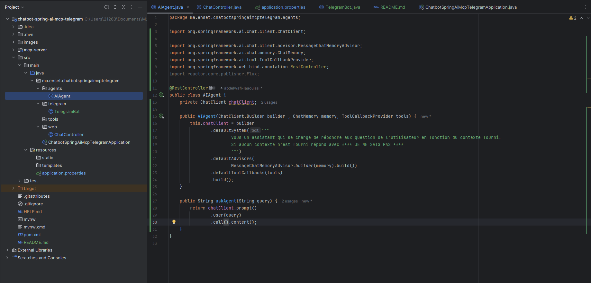
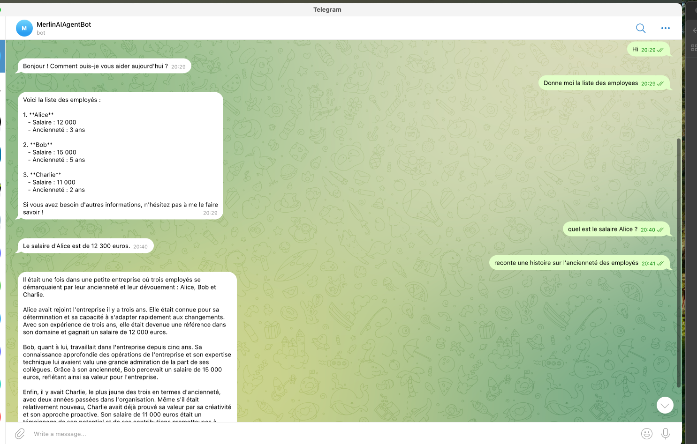

# ChatBot AI Agent(Spring Boot + Spring AI + OpenAI + Telegram Integration)
---

## Key Features

| Feature                    |
|----------------------------|
| **AI Assistant**           |
| **MCP Server Integration** |
| **REST API**               |
| **Telegram Bot**           |
| **Modular Design**         |
| **Configurable Secrets**   |

---

## Project Structure

- `mcp-server/` - Spring Boot application implementing the MCP Server
- `bot-ai-agent/` - Spring Boot application implementing the AI Agent with Telegram integration




---

## How It Works

1. **User Input**
    - The user sends a message via **Telegram** or calls the **REST API**.

2. **AI Reasoning with MCPTools**
    - The message is processed by `Spring AI`, powered by an **OpenAI model**.
    - The AI Agent analyzes the intent (e.g., *“show me all employees”* or *“what’s Alice’s salary?”*).

3. **Data Fetching (MCP Server)**
    - The AI Agent calls the **MCP Server** to fetch structured data (like employee records).

4. **Response Generation**
    - The agent formulates a human-readable, contextual response (e.g., explanations, summaries, stories).

5. **Delivery**
    - The response is sent back via Telegram or returned as Stream.

---

## Telegram Bot Demo

Example conversation:



# Running the Project
## Prerequisites
- Java 21+
- Spring Boot
- OpenAI API
- Telegram Bots API
- Maven

## 1 – Run MCP Server

```shell
cd mcp-server
mvn spring-boot:run

npx -y @modelcontextprotocol/inspector 
# Transport Type: Streamable HTTP
# URL: http://localhost:8989/mcp
# Connection Type: Via Proxy
```


MCP Server is a Spring Boot application that implements the Model Context Protocol (MCP) server functionality. it provide informations about employees
---

## Configuration

### 1. Environment Variables
Create a `.env` or configure your environment with:

```bash
OPENAI_API_KEY=sk-xxxxxxx
TELEGRAM_BOT_TOKEN=xxxxxxx
```

# License
This project is licensed under the MIT License — feel free to use and adapt it.